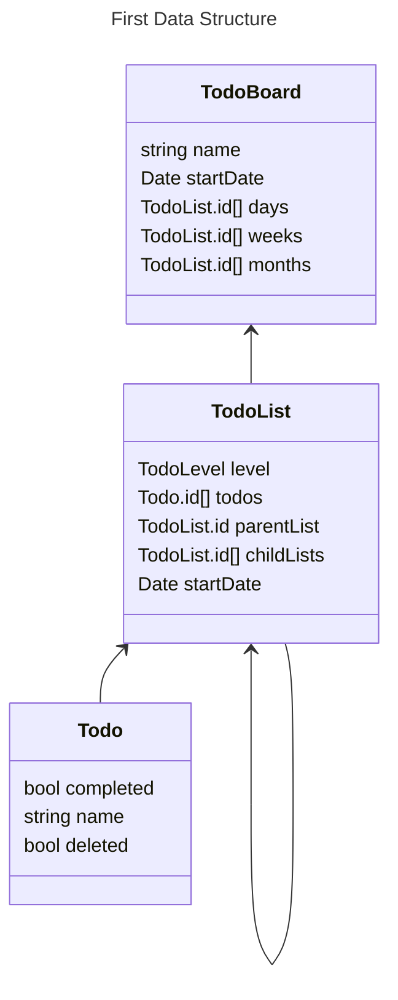
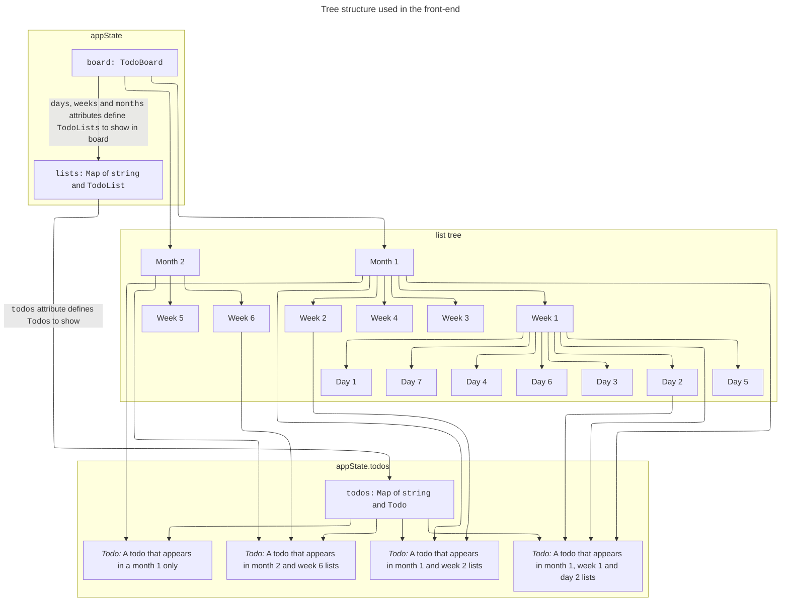
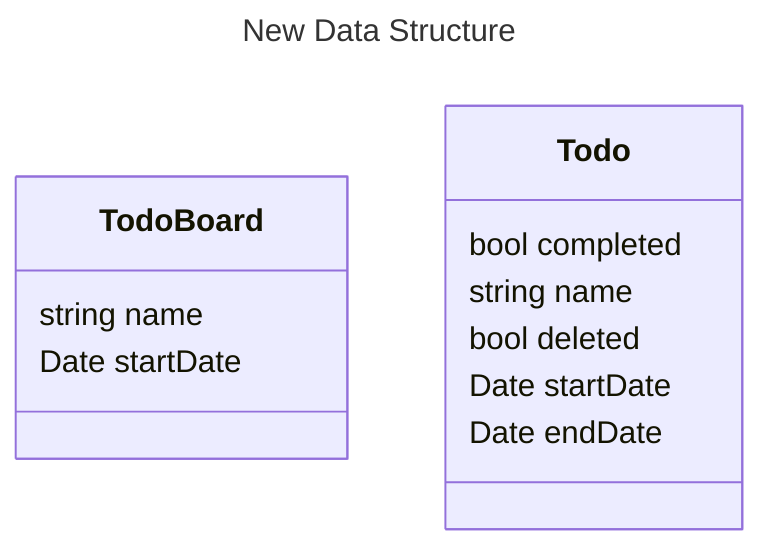
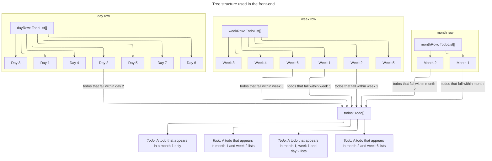

# 1. Move from tree based data structure to filtered query

Date: 2023-12-20

## Status

- 2023-12-20 proposed
- 2023-12-23 accepted

## Context

The initial data structure for this app was based on a tree of nested lists:

Which was turned into a tree in the front-end like:

This tree structure made it hard to move the `Todo` items about as the tree would need to be traversed to update all
parent and child list depending on the move being made.

## Decision
During the discovery into building an iOS version of Atomic Todo with SwiftData I was forced to refactor the data model
to be more like one found in a relational database which meant that I could no longer rely on the tree structure.

I instead assigned a `startDate` and `endDate` to the `Todo` which would then be used within in the `TodoList` (which
had its own `startDate` and `endDate`) to filter the list of `Todo`s to only show those that fell within that the `TodoList`s
time range.

This worked really well as updates to the `startDate` and `endDate` on the `Todo` would result in the `Todo` being moved
to whichever `TodoList` covered the period for those dates and there was no need to have the complex tree traversal logic to
update the lists.

This approach also scaled well for creating more or less lists.

In the server code the `query` to get the `TodoBoard` and `Todo`s is quite simple as it now just finds all `Todo`s that
fall within the six-month period covered by the board.

In the front-end code the `TodoList`s are generated based on the granularity and the number of lists to show, with the
`startDate` and `endDate` being set based on the dates relative to the board's start date.

This means the front-end data structure looks like this:

## Consequences

The appwrite schema, GraphQL schema, server code and front-end code will need to be refactored to work with the new data
structure. This has been tracked by the following issues:

- [Refactor Appwrite schema to remove TodoLists](https://github.com/colinfwren/atomic-todo/issues/5)
- [Refactor GraphQL schema to remove TodoList heirarchy](https://github.com/colinfwren/atomic-todo/issues/6)
- [Refactor fetching and rendering of TodoBoard to reflect GraphQL schema changes](https://github.com/colinfwren/atomic-todo/issues/11)
- [Refactor code for moving Todo between TodoLists](https://github.com/colinfwren/atomic-todo/issues/12)
- [Refactor changing Todo position in TodoList](https://github.com/colinfwren/atomic-todo/issues/21)
