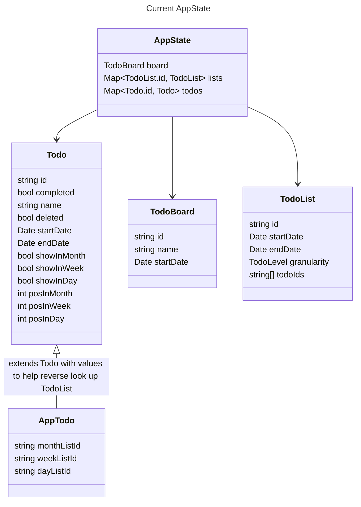
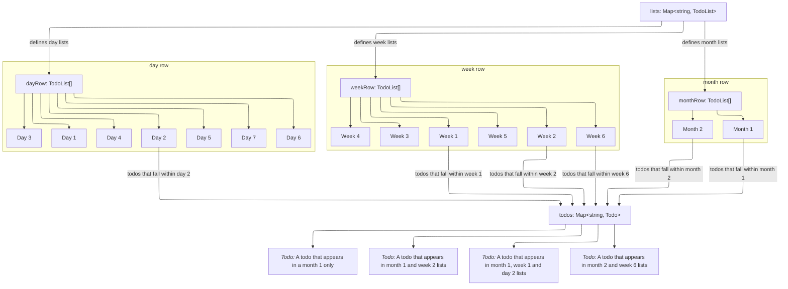
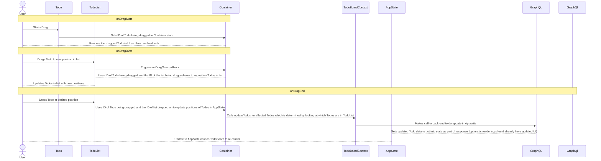
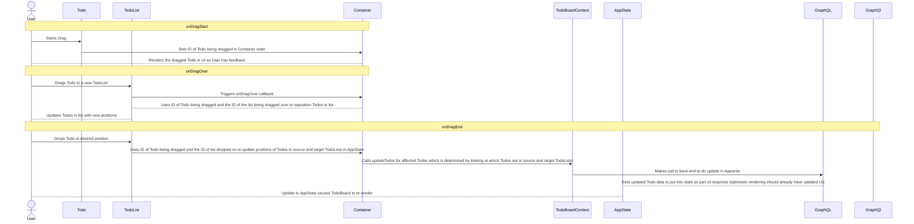

# 2. Using Maps of Todos and TodoLists in AppState to make drag and drop easier to manage

Date: 2023-12-26

## Status

2023-12-26 proposed
2023-12-27 accepted

## Context

With the refactor from tree based data structure to filtered query there's no longer a quick means to look up which 
`Todos` are in a Todo list or to access a `Todo` directly in the front-end. 

This makes it harder to manage the drag and drop functionality
as there needs to be some concept of a `TodoList` to move the items between or within.

This proposal is to re-introduce the `TodoList` structure and to have `AppState` work with `Map`s of `TodoList`s and 
`Todo`s so that the front-end can both organise and render the todo lists in a more efficient manner.

When the front-end receives the data from the GraphQL responses it'll create the maps which will then be used in the app
state to render the lists.

Then when changing the position of a `Todo` in a `TodoList` (not moving it between lists). The following can be done

Then when moving a `Todo` from one `TodoList` to another, the following can be done.

## Decision

I decided to go with it as was how the app was previously working and using a `Map` gives a nice API for finding `TodoList`s 
and `Todo`s based on ID.
 
## Consequences

Will need to refactor `AppState` and `onDragStart`, `onDragOver` and `onDragEnd` callbacks in `Container` (although this
would likely just be bringing back old tree data structure callback code for the most part).

There's a potential this could be done in the back-end but as `TodoList` is really a display need instead of a data need
I don't think this too good an idea.
