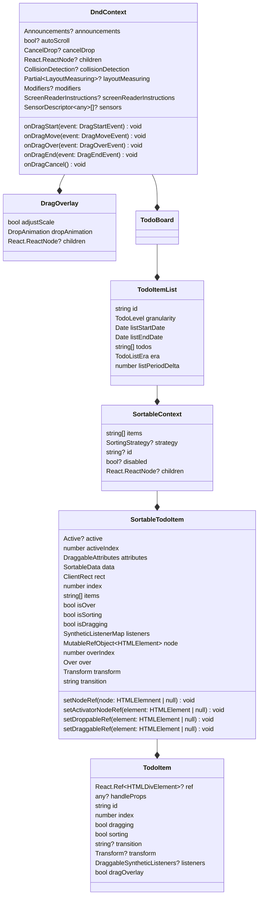
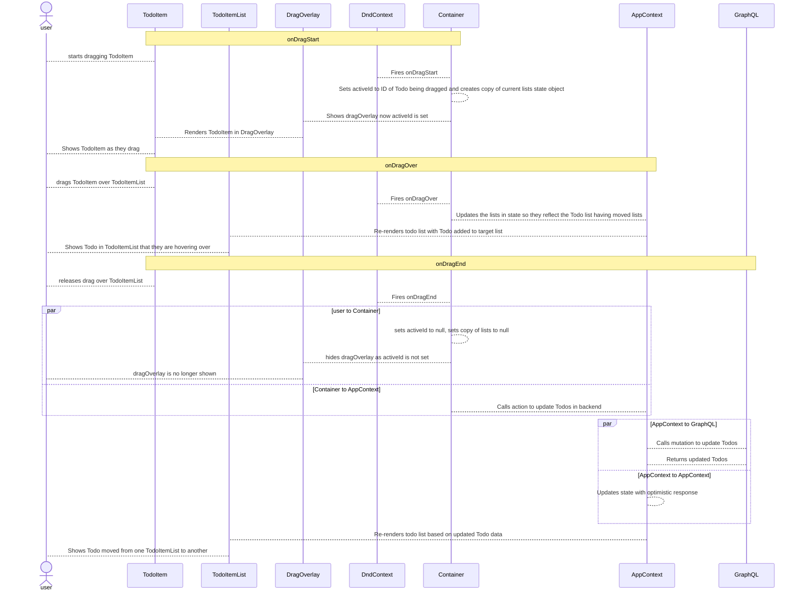
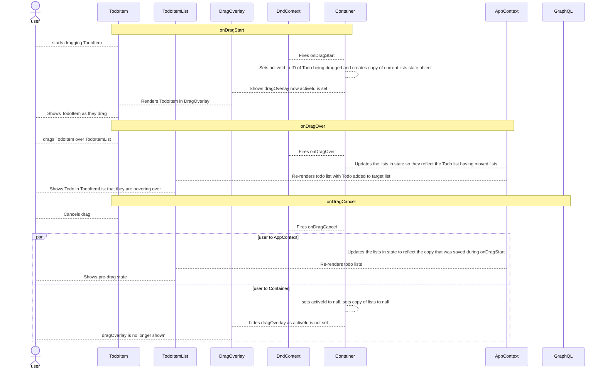

# 3. Use dnd kit for drag and drop in front-end

Date: 2023-12-27

## Status

2023-12-27 accepted

## Context

To move Todos from within lists to reposition them or between lists to change the granularity
of them I decided to use a drag 'n' drop UX as on desktop makes things easier.

`@dnd-kit` provides React components and hooks to manage the drag 'n' drop life cycle in the browser. This comprises of
the following concepts:

- `DndContext`: A context within which the drag 'n' drop events will be made available to the components implementing the 
    `useDraggable` (i.e. the todo) and `useDroppable` (i.e. the todo list) hooks. It makes use of the following callbacks
  - `onDragStart`: Called when the drag starts, allows state to be set to block interactions while a drag happens. 
    Provides ID and data object for the dragged component
  - `onDragMove`: Called when the dragged component is moved
  - `onDragOver`: Called when the dragged component enters the area of a container it can be dropped into. Provides the
    ID and data object for the container the draggable component is over
  - `onDragEnd`: Called when the user drops the dragged component into a container. Provides IDs and data for the 
    dragged component and the container it was dropped in
  - `onDragCancel`: Called if the drag 'n' drop operation is cancelled by the user (e.g. they press ESC key)
- `useDroppable` hook: A hook which provides props for handling if the component is currently having a draggable item 
  dragged over it or not
- `useDraggable` hook: A hook which provides props for handling dragging a component such as updating the styles
- `SortableContext`: A context within which the drag 'n' drop events will be able to re-order the items in the list
- `useSortable` hook: A hook which provides props for handling changing the position of elements in a list

For the use-case within Atomic Todo:

- The app is wrapped in a `DndContext` so that all drag 'n' drop events within and between lists can be actioned
  - In the `onDragStart` callback a copy of the `lists` state object is taken so that `lists` can be updated as part of
    the `onDragOver` callback to show the dragged item in the list it's over
  - In the `onDragOver` callback the `todos` value of the `TodoItemList` the dragged `Todo` is over is updated to add 
    that `Todo` at the position it currently would be in
  - In the `onDragCancel` callback the copy of the `lists` state object that was made is restored so the data resets
  - In the `onDragEnd` callback the changes that have been made are sent to the GraphQL server to update the `Todo`s that
    have been impacted by the operation
- Each `TodoItemList` component wraps its list of `TodoItem`s in a `SortableContext` so that the list items can be re-ordered
- Each `TodoItem` is wrapped in a `SortableTodoItem` component that provides the props for making the items sortable

Sequence of operations that happens when moving Todo within or between lists

Sequence of operations that happens when cancelling a Todo move

## Decision

Decided to use `@dnd-kit` to handle drag and drop

## Consequences

Need to use `Map`s to keep track of lists and todos in state so can look up by ID. See [#0002](./0002-using-maps-for-todos-and-todolists-in-appstate-to-make-drag-and-drop-easier-to-manage.md)
for details on that decision.
