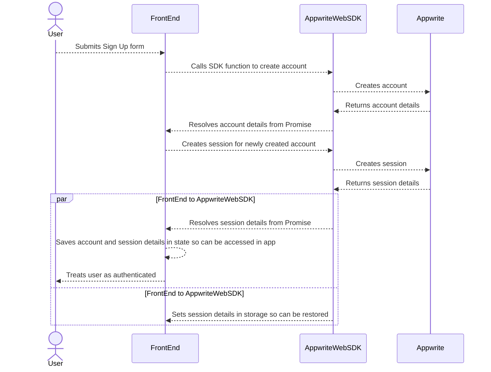
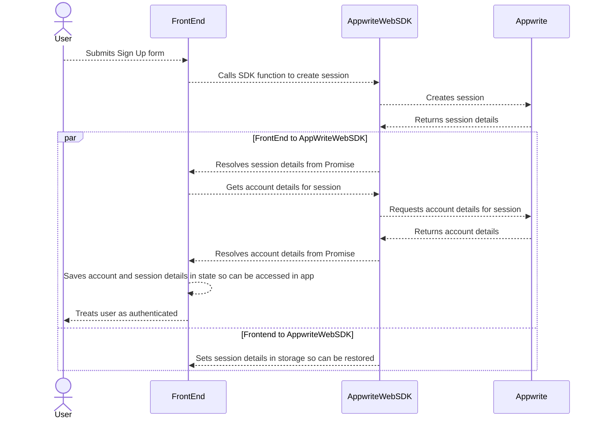
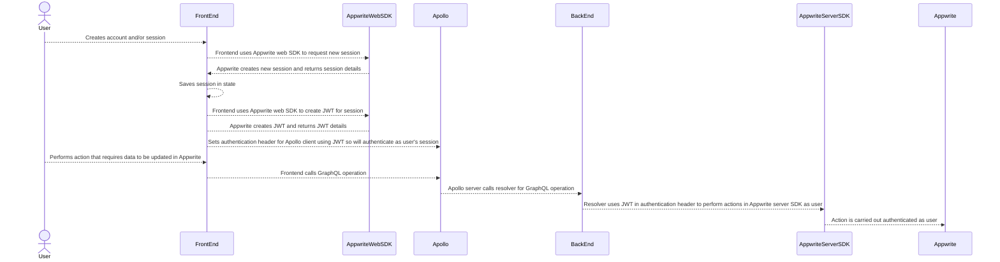

# 4. Use Appwrite web SDK for authentication

Date: 2023-12-28

## Status

- 2023-12-28 proposed
- 2023-12-28 accepted

## Context

In order to allow different users to use Atomic Todo there needs to be some means of creating accounts and authenticating
users.

Appwrite provides a means to create an account via its web and server SDKs but only provides a means to create a session
via its web SDK.

This means that the front-end will need to be handle authentication and provide a JWT or other mechanism for the back-end
to interact with the user's data in Appwrite.

To create an account this flow would be used

To create a new session for a user with an account this flow would be used

When calling GraphQL operations that require authentication the flow would be used

## Decision

The use of a JWT to authenticate within the back-end is a standard pattern that Apollo handles well enough so happy to 
do things this way.

## Consequences

- The Appwrite web SDK needs to be added to the project dependencies
- In the front-end an Appwrite service needs to be created to ensure only one instance of the client is created
- In the front-end a context for dealing with authentication needs to created so the authentication state can be accessed
  across components and abstracts the authentication logic into a central place. This context should also deal with
  restoring existing sessions when the user reloads the page etc
- In the back-end the queries and mutations that require an authenticated sessions need to be refactored to work with
  the JWT and to make use of the session
- In the data model the resources that need to be linked to a user need to be updated to have the correct permissions 
  and roles
- 
