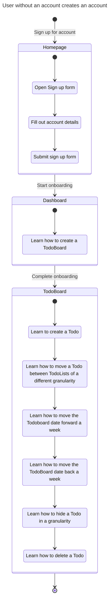
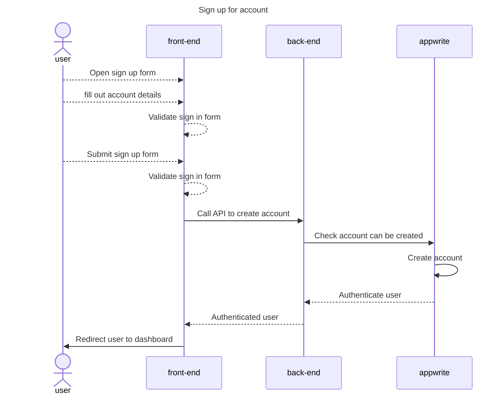
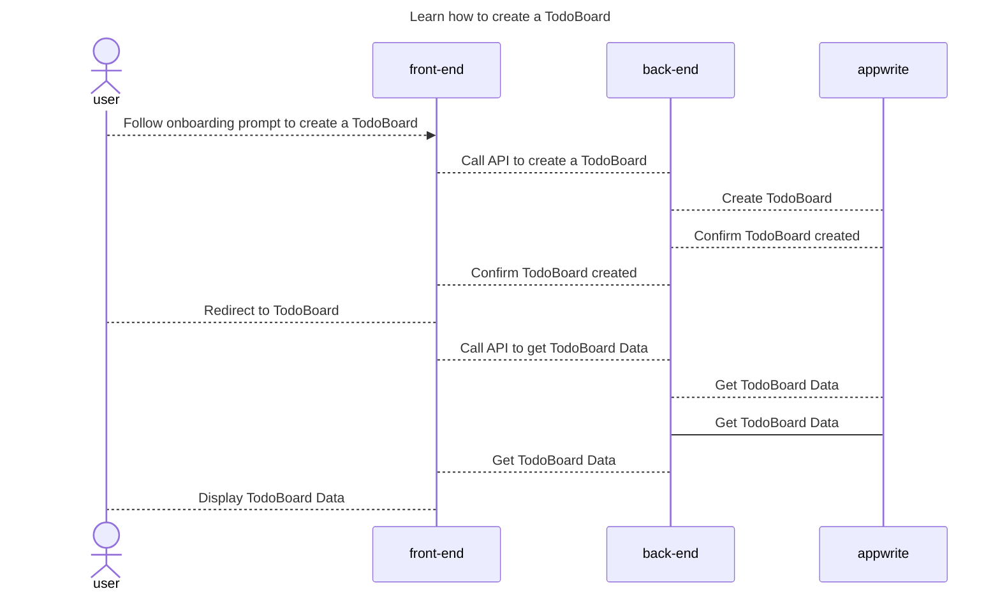
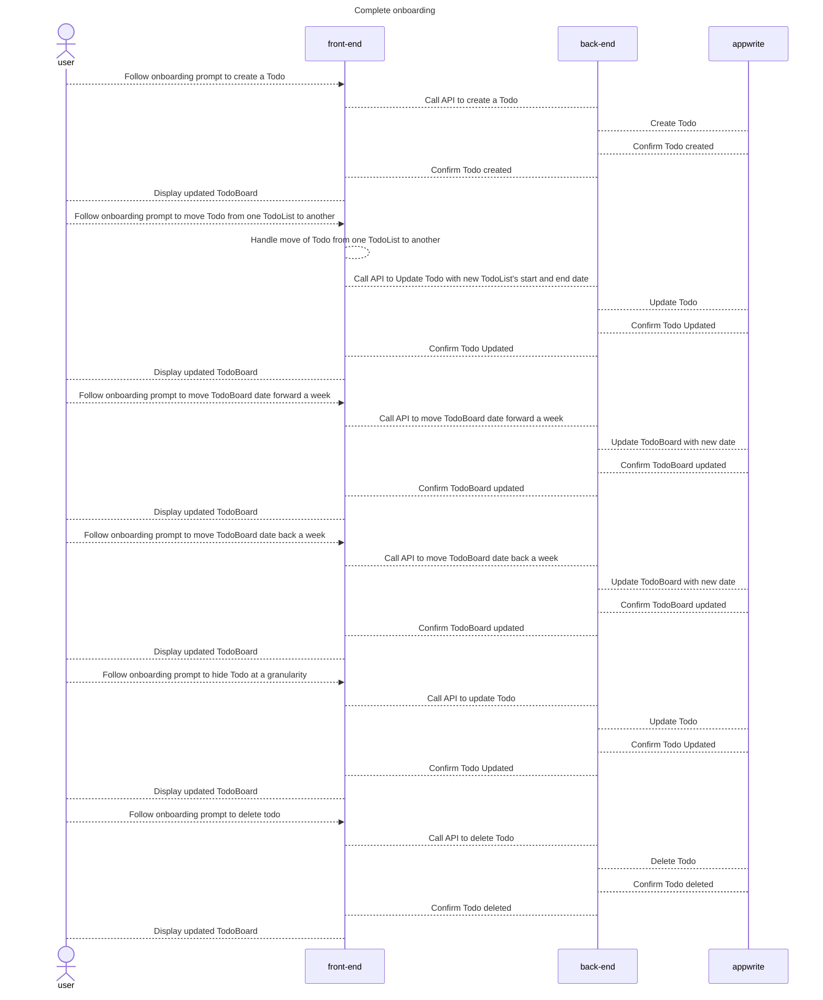
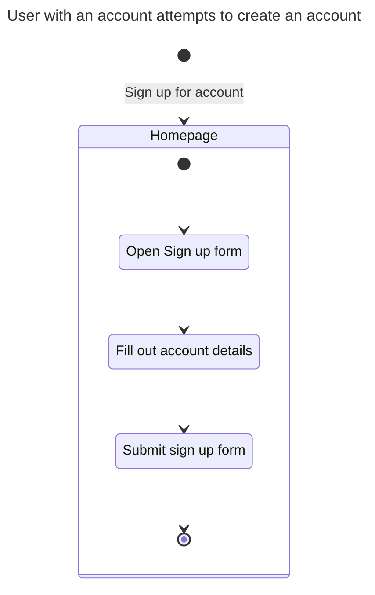
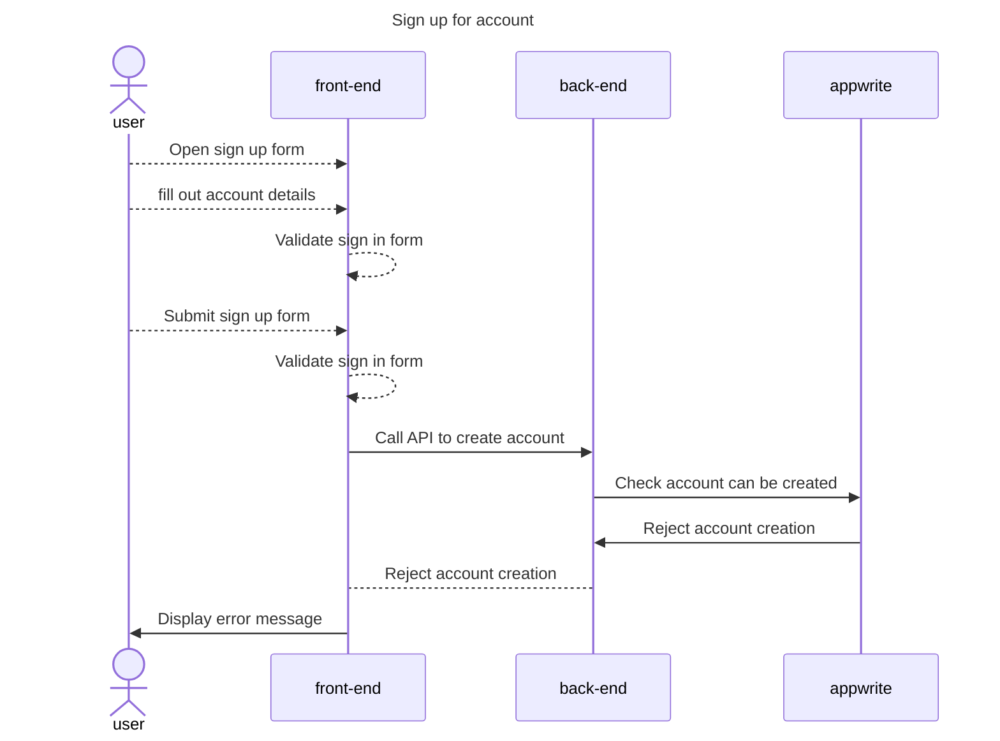

# Creating an account

## Happy Path Flows

### User without an account creates an account
Persona: [User without an account](../personas/user-without-an-account.md)

#### Flow

#### Sequence Diagrams
##### Sign up for account

##### Start Onboarding

##### Complete Onboarding

## Alternate Path Flows

### User with an account attempts to create an account
Persona: [User with an account](../personas/user-with-an-account.md)

#### Flow

#### Sequence Diagrams
##### Sign up for account
