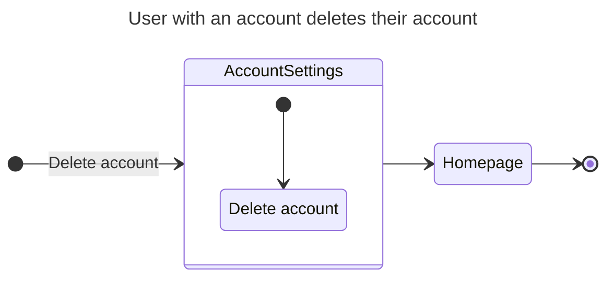
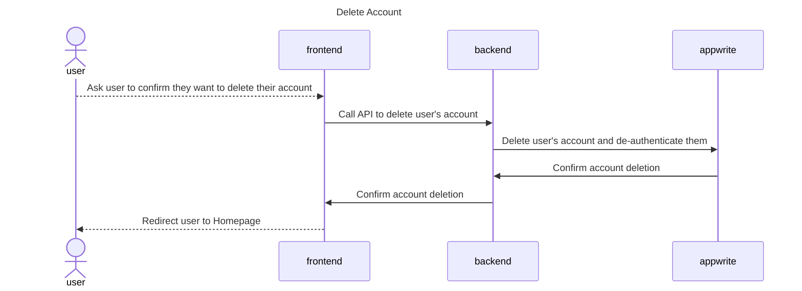

# Deleting an account

## Happy Path Flows

### User with an account deletes their account
Persona: [User with an account](../personas/user-with-an-account.md)

#### Flow

#### Sequence Diagrams
##### Delete Account

