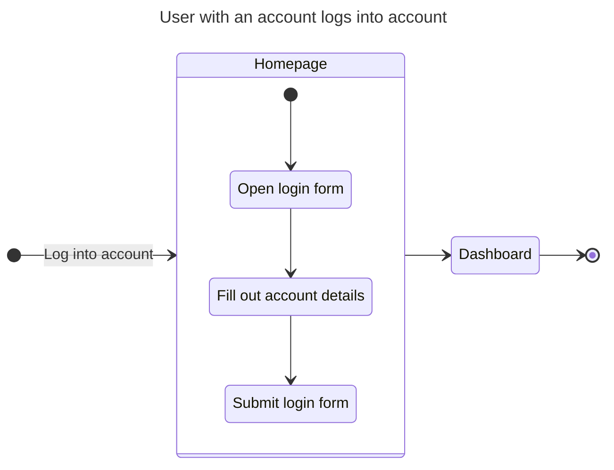
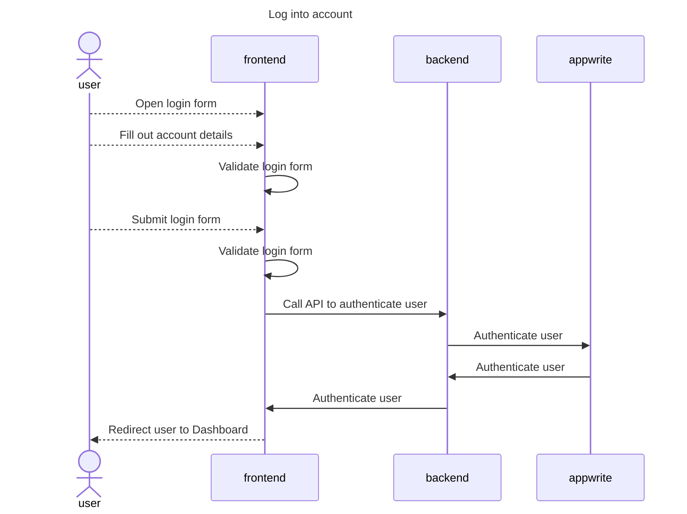
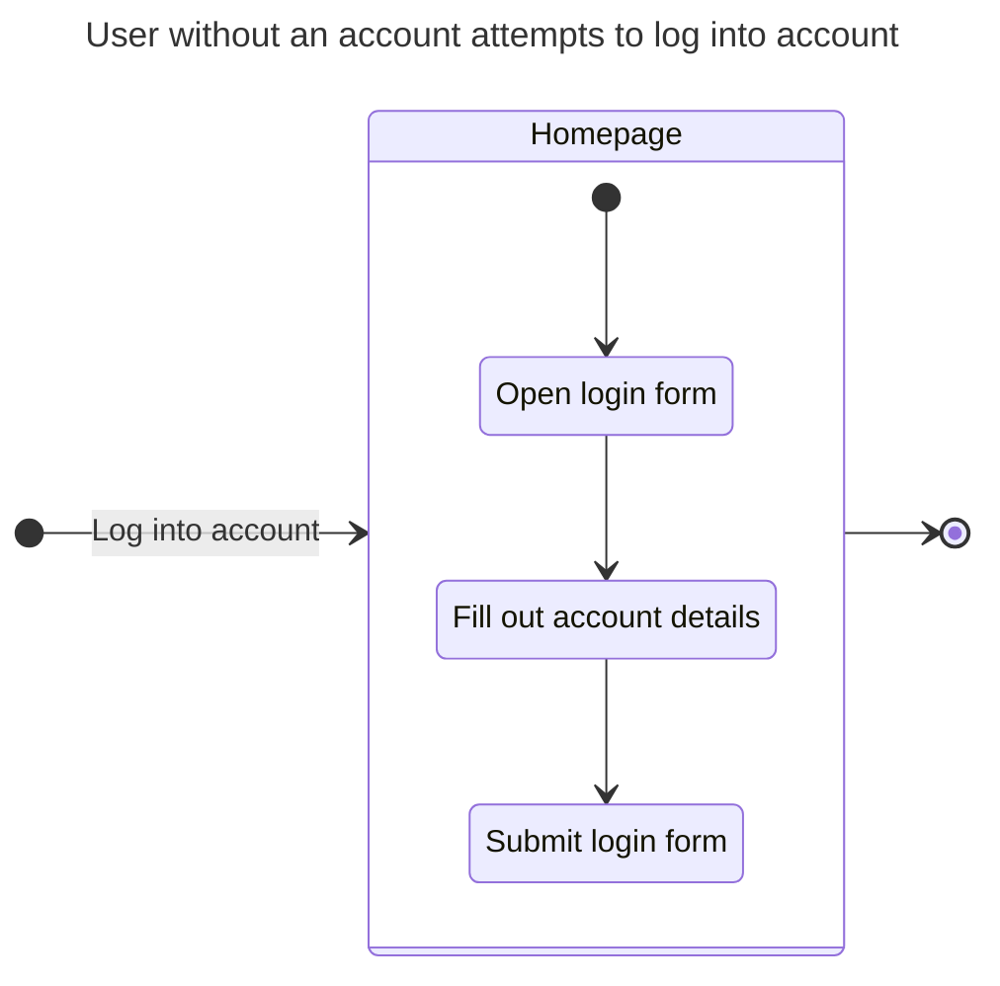
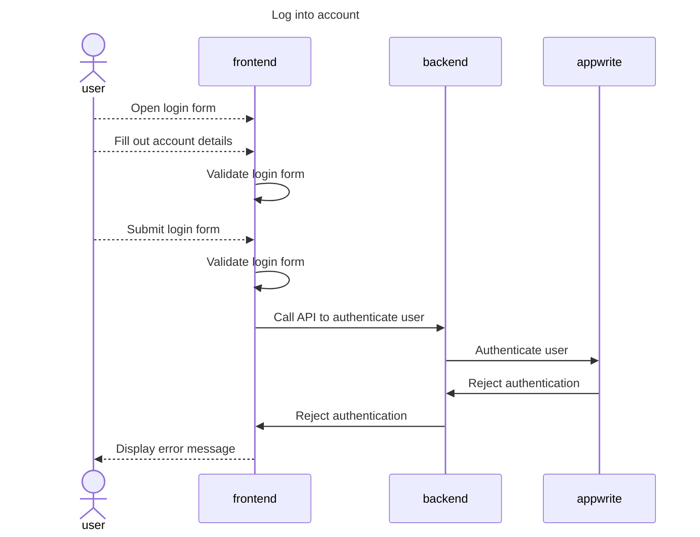

# Logging in

## Happy Path Flows

### User with an account logs into account
Persona: [User with an account](../personas/user-with-an-account.md)

#### Flow

#### Sequence Diagrams
##### Log into account

## Alternate Path Flows

### User without an account attempts to log into account
Persona: [User without an account](../personas/user-without-an-account.md)

#### Flow

#### Sequence Diagrams
##### Log into account

