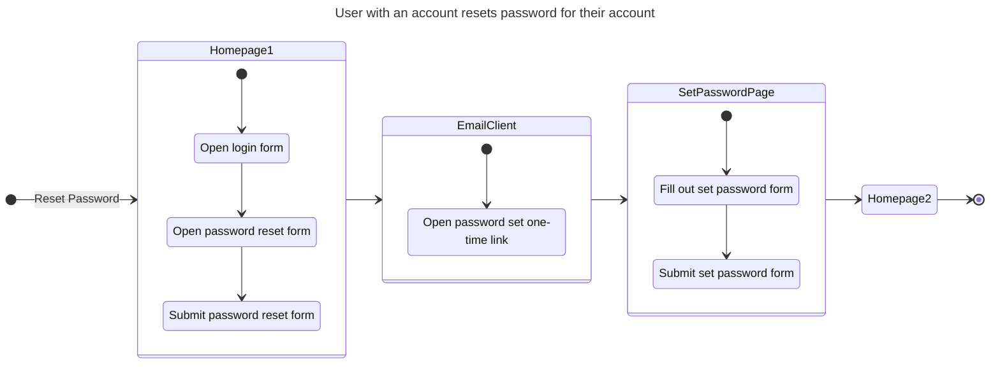
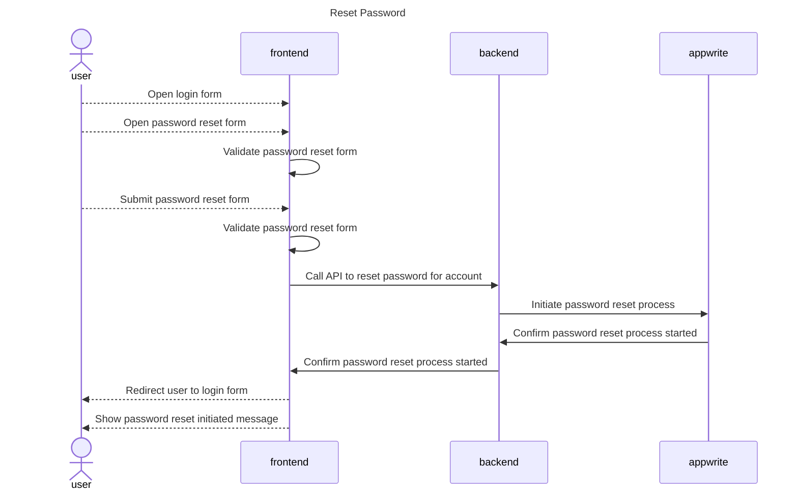
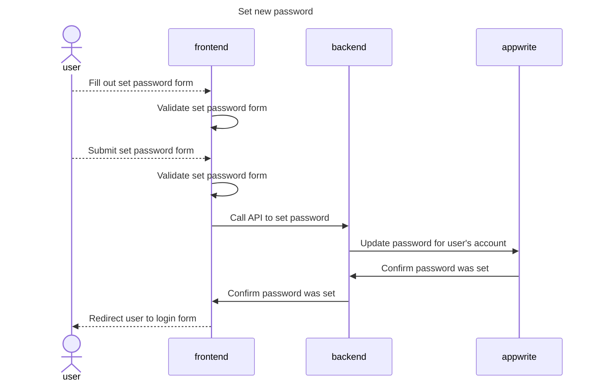
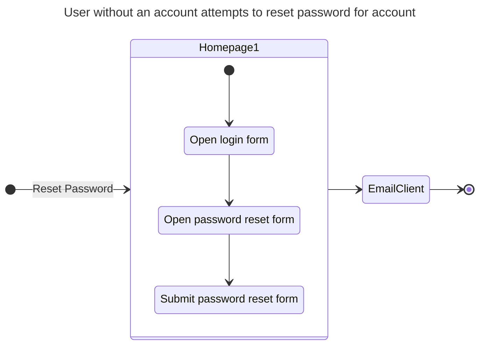

# Deleting an account

## Happy Path Flows

### User with an account resets password for their account
Persona: [User with an account](../personas/user-with-an-account.md)

#### Flow

#### Sequence Diagrams
##### Reset Password

## Alternate Path Flows

### User without an account attempts to reset password for account
Persona: [User without an account](../personas/user-without-an-account.md)

#### Flow

#### Sequence Diagrams
##### Reset Password
