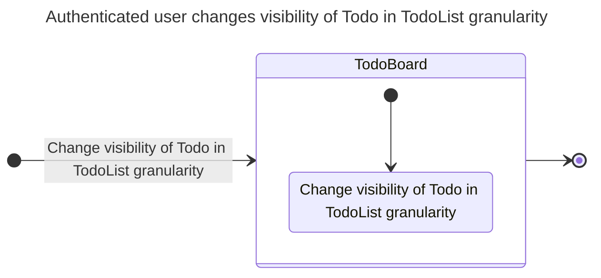
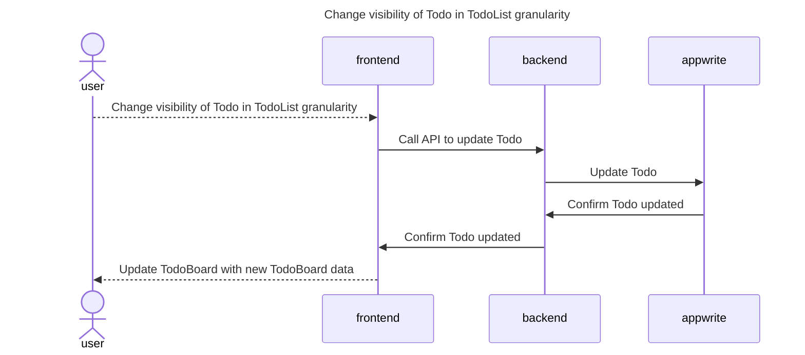
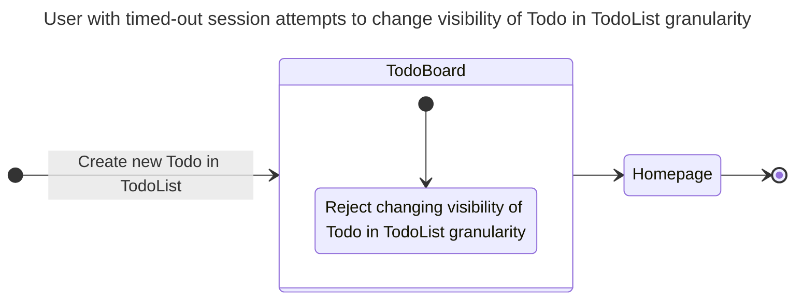
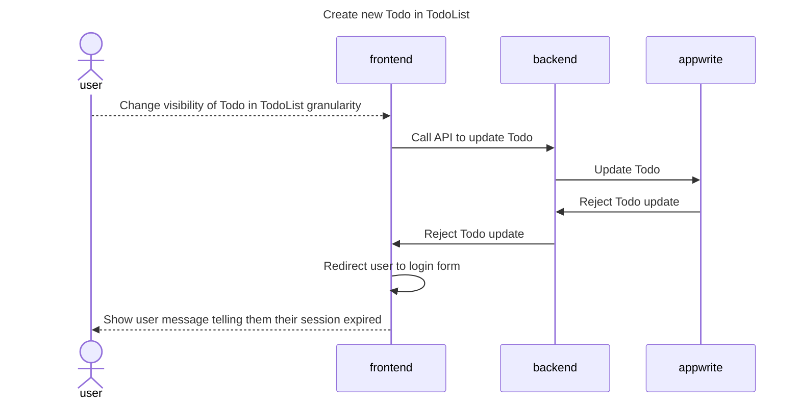

# Changing Todo visbility

## Happy Path Flows

### Authenticated user changes visibility of Todo in TodoList granularity
Persona: [Authenticated user](../personas/authenticated-user.md)

#### Flow

#### Sequence Diagrams
##### Change visibility of Todo in TodoList granularity

## Alternate Path Flows
### User with timed-out session attempts to change visibility of Todo in TodoList granularity
Persona: [User with timed-out session](../personas/user-with-timed-out-session.md)

#### Flow

#### Sequence Diagrams
##### Create new Todo in TodoList
