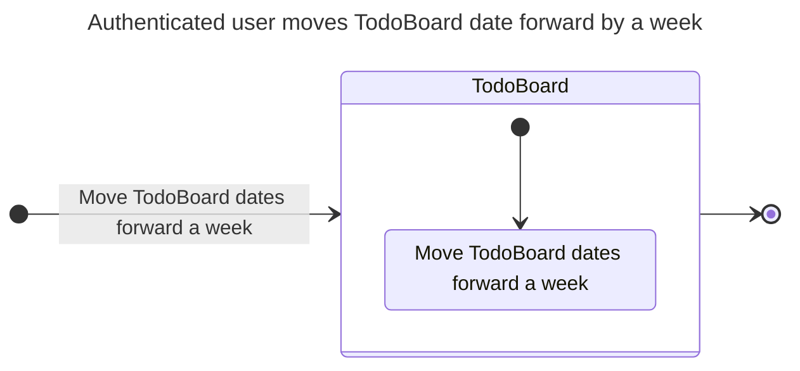
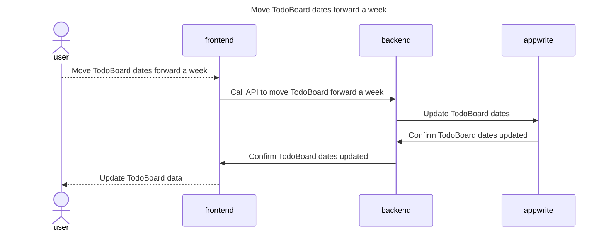
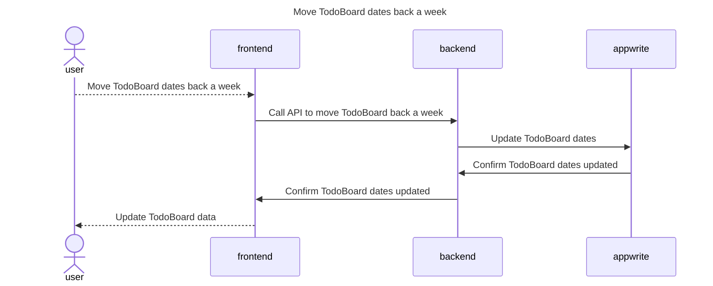
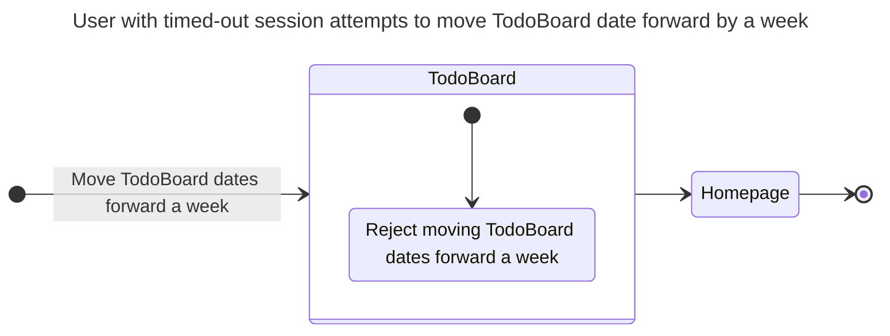
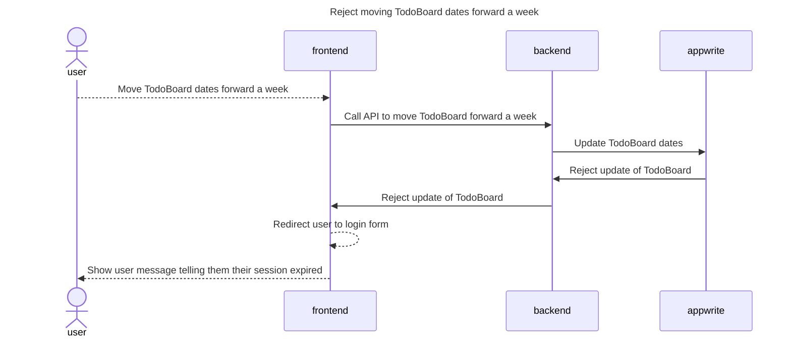
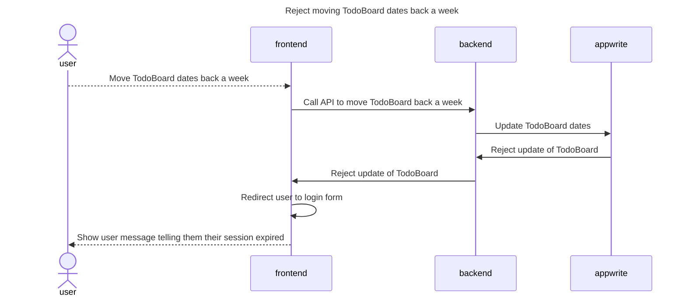

# Changing TodoBoard dates

## Happy Path Flows

### Authenticated user moves TodoBoard date forward by a week
Persona: [Authenticated user](../personas/authenticated-user.md)

#### Flow

#### Sequence Diagrams
##### Move TodoBoard dates forward a week

### Authenticated user moves TodoBoard date backward by a week
Persona: [Authenticated user](../personas/authenticated-user.md)

#### Flow

#### Sequence Diagrams
##### Move TodoBoard dates back a week

## Alternate Path Flows
### User with timed-out session attempts to move TodoBoard date forward by a week
Persona: [User with timed-out session](../personas/user-with-timed-out-session.md)

#### Flow

#### Sequence Diagrams
##### Reject moving TodoBoard dates forward a week

### User with timed-out session attempts to move TodoBoard date backward by a week
Persona: [User with timed-out session](../personas/user-with-timed-out-session.md)

#### Flow

#### Sequence Diagrams
##### Reject moving TodoBoard dates back a week
