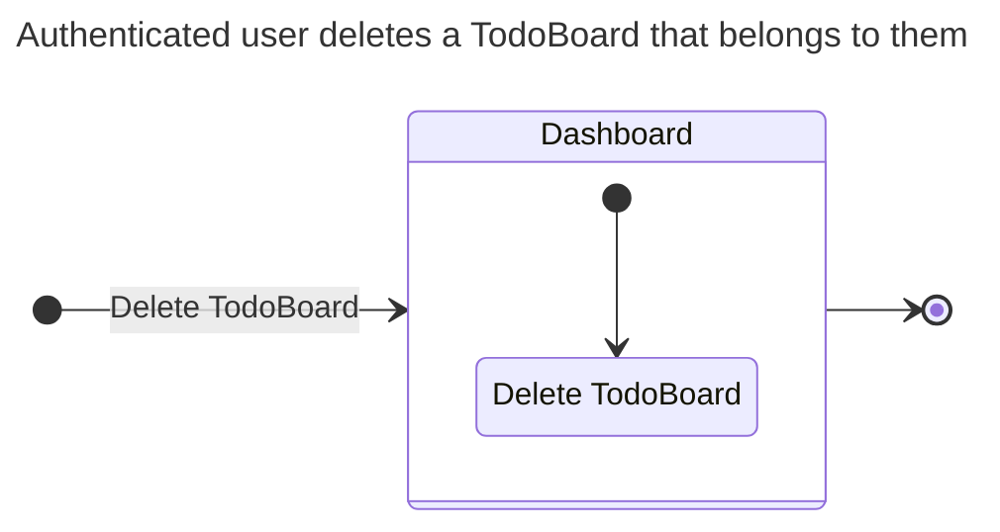
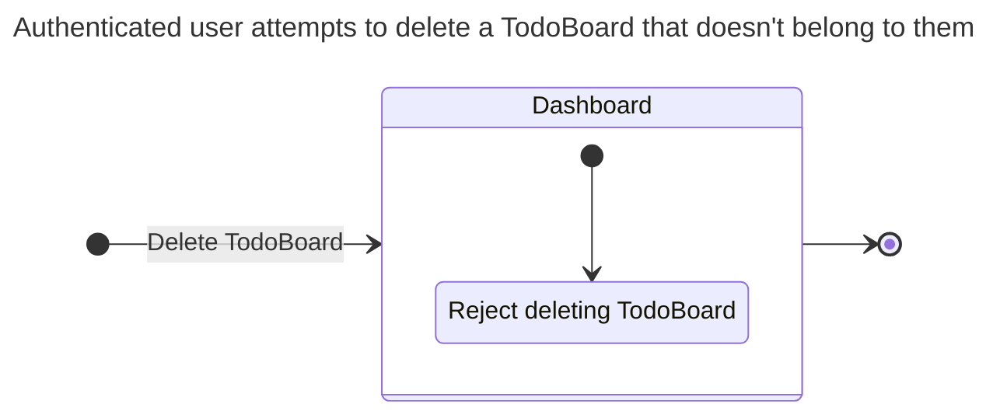
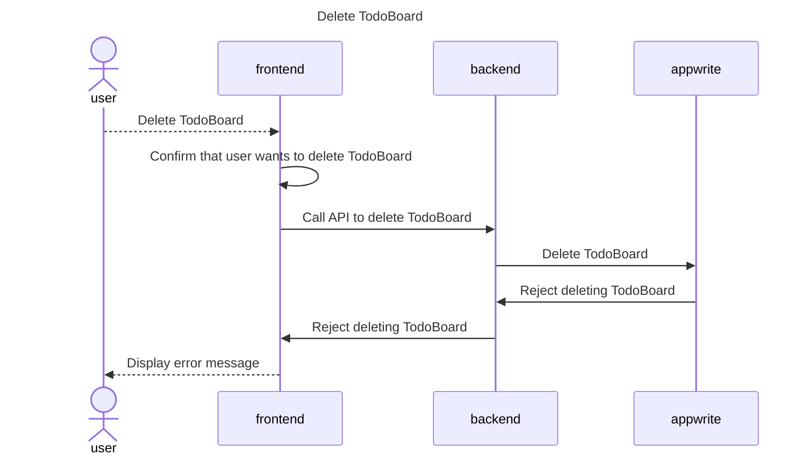
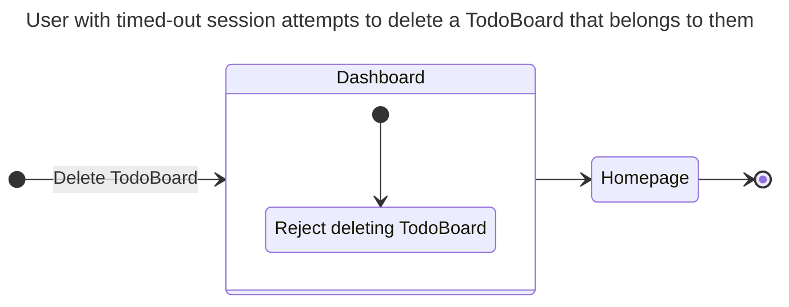
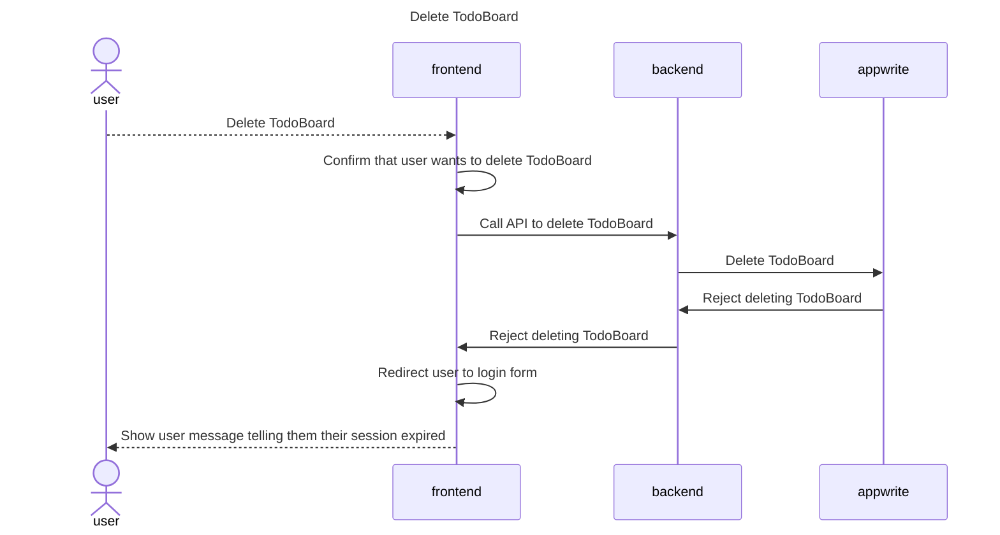

# Deleting a TodoBoard

## Happy Path Flows

### Authenticated user deletes a TodoBoard that belongs to them
Persona: [Authenticated user](../personas/authenticated-user.md)

#### Flow

#### Sequence Diagrams
##### Delete TodoBoard

## Alternate Path Flows
### Authenticated user attempts to delete a TodoBoard that doesn't belong to them
Persona: [Authenticated user](../personas/authenticated-user.md)

#### Flow

#### Sequence Diagrams
##### Delete TodoBoard

### User with timed-out session attempts to delete a TodoBoard that belongs to them
Persona: [User with timed-out session](../personas/user-with-timed-out-session.md)

#### Flow

#### Sequence Diagrams
##### Delete TodoBoard
