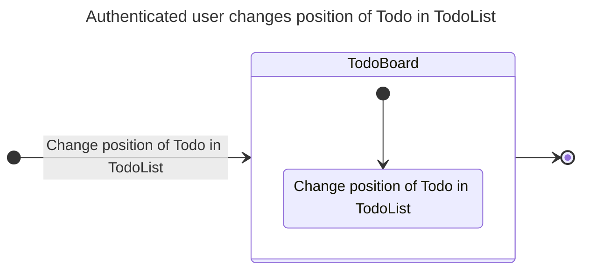
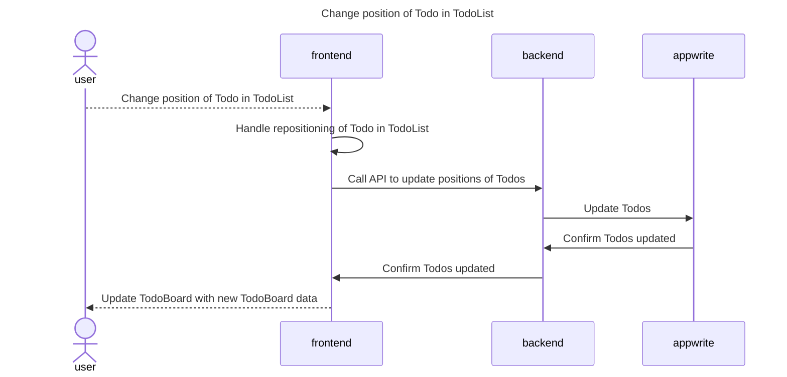
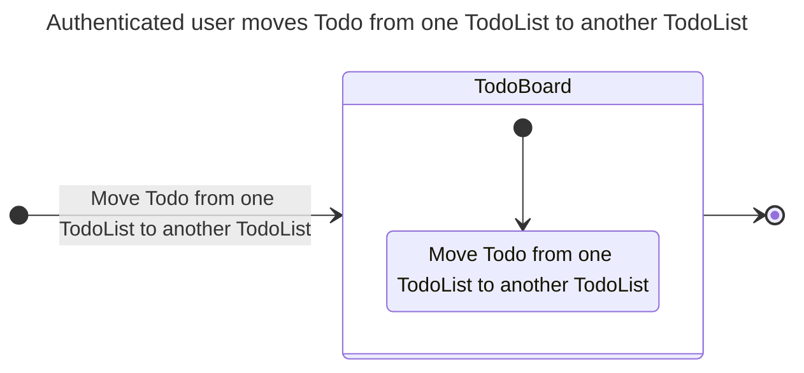
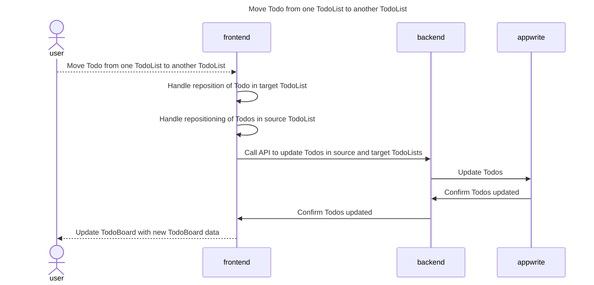
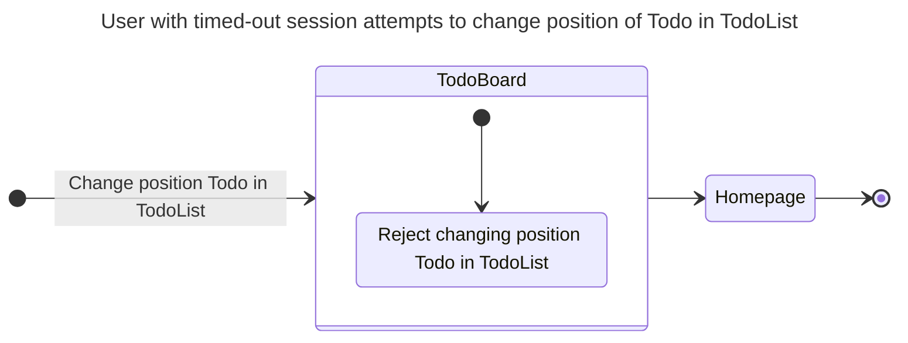
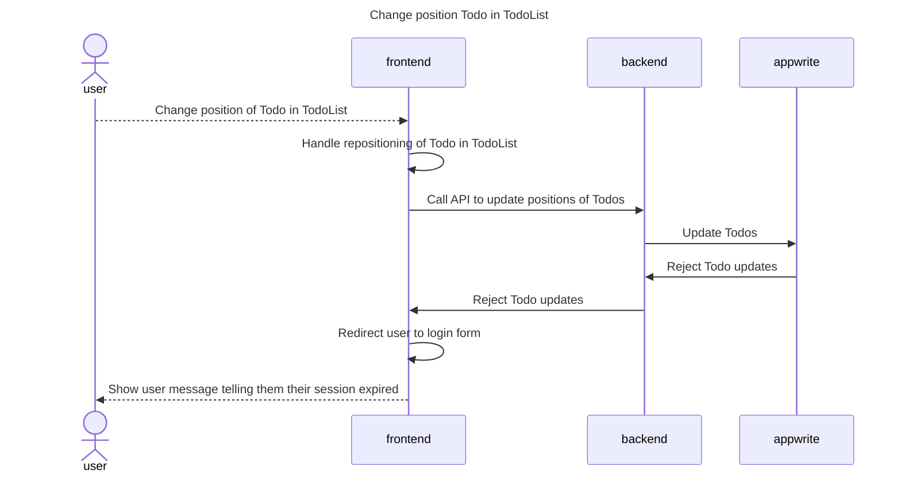
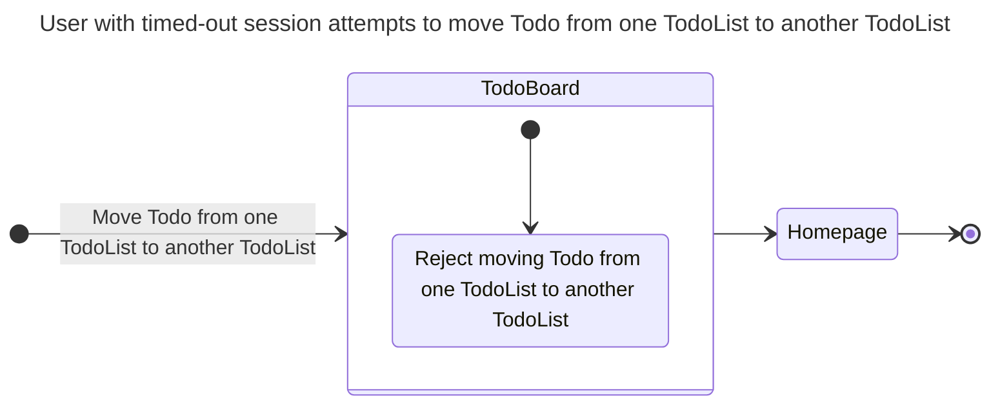
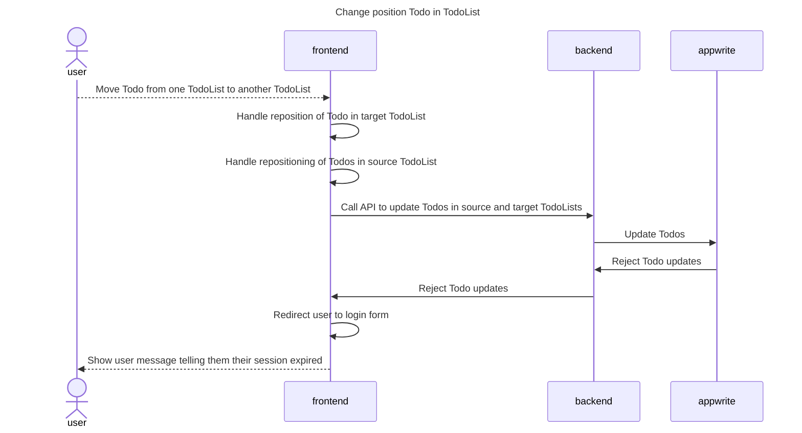

# Moving a todo

## Happy Path Flows

### Authenticated user changes position of Todo in TodoList
Persona: [Authenticated user](../personas/authenticated-user.md)

#### Flow

#### Sequence Diagrams
##### Change position of Todo in TodoList

### Authenticated user moves Todo from one TodoList to another TodoList
Persona: [Authenticated user](../personas/authenticated-user.md)

#### Flow

#### Sequence Diagrams
##### Move Todo from one TodoList to another TodoList

## Alternate Path Flows
### User with timed-out session attempts to change position of Todo in TodoList
Persona: [User with timed-out session](../personas/user-with-timed-out-session.md)

#### Flow

#### Sequence Diagrams
##### Change position Todo in TodoList

### User with timed-out session attempts to move Todo from one TodoList to another TodoList
Persona: [User with timed-out session](../personas/user-with-timed-out-session.md)

#### Flow

#### Sequence Diagrams
##### Move Todo from one TodoList to another TodoList
