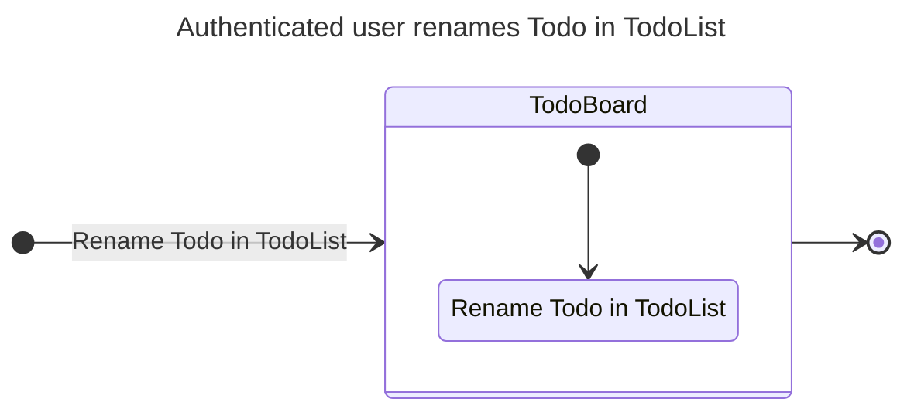
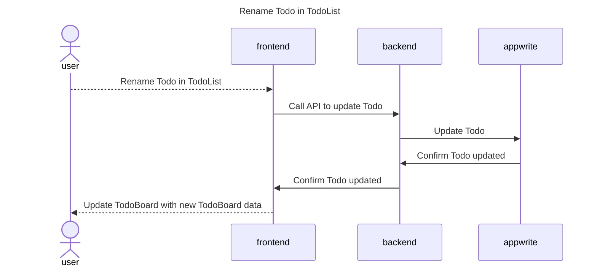
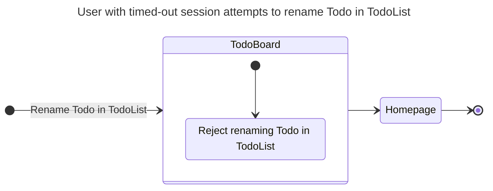
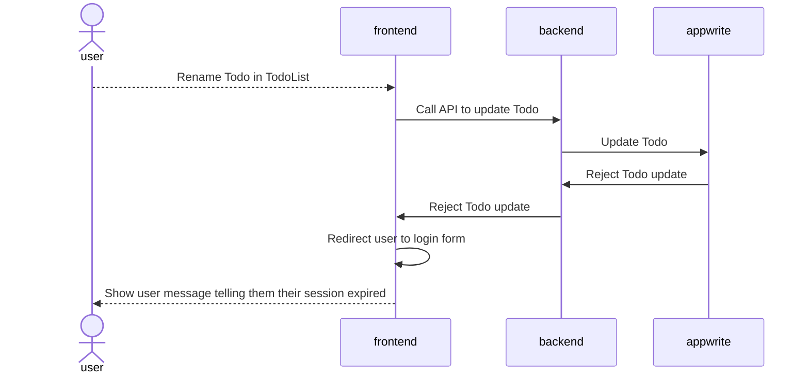

# Renaming a todo

## Happy Path Flows

### Authenticated user renames Todo in TodoList
Persona: [Authenticated user](../personas/authenticated-user.md)

#### Flow

#### Sequence Diagrams
##### Rename Todo in TodoList

## Alternate Path Flows
### User with timed-out session attempts to rename Todo in TodoList
Persona: [User with timed-out session](../personas/user-with-timed-out-session.md)

#### Flow

#### Sequence Diagrams
##### Rename Todo in TodoList
