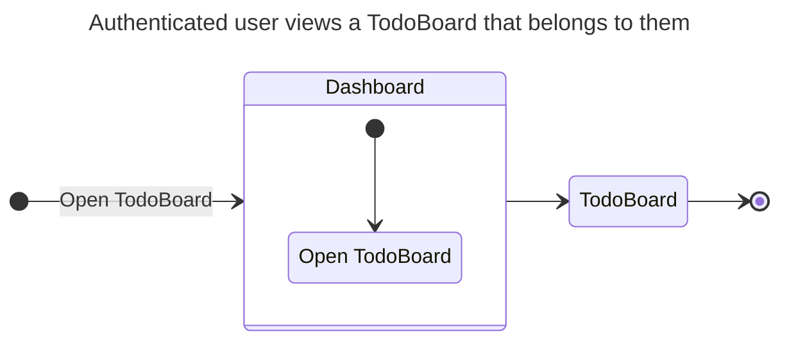
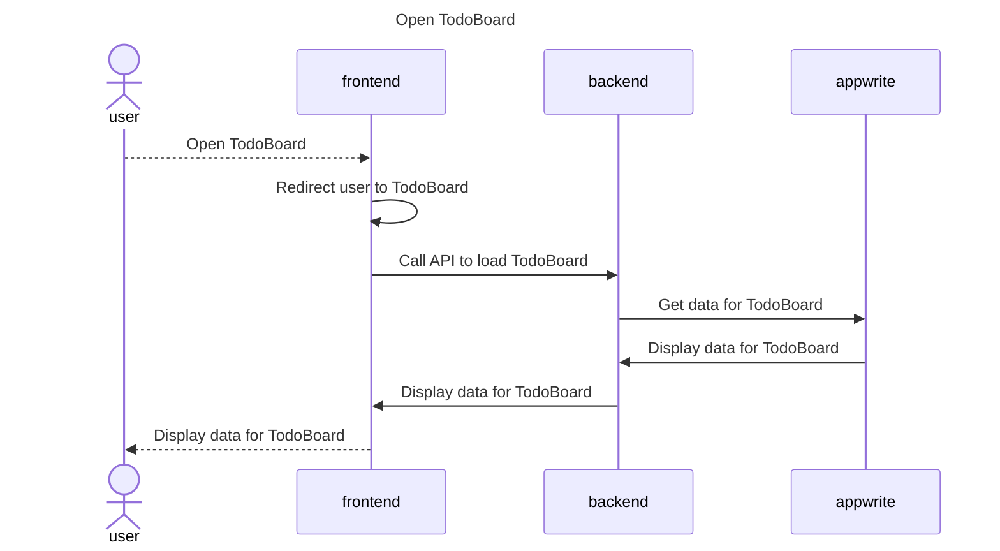
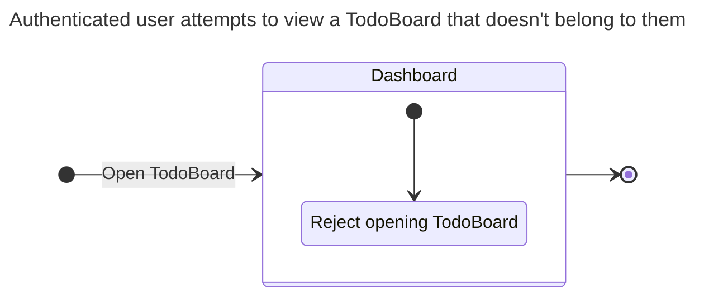
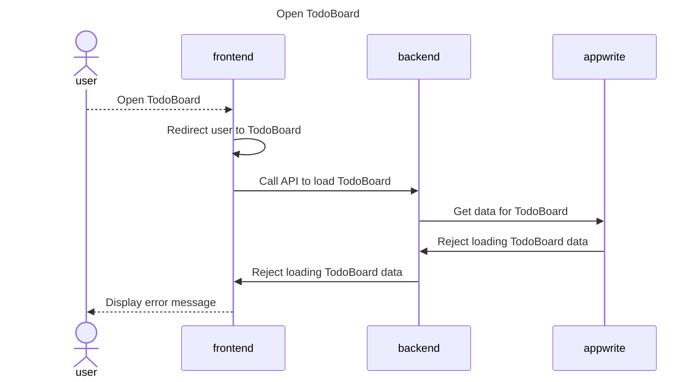
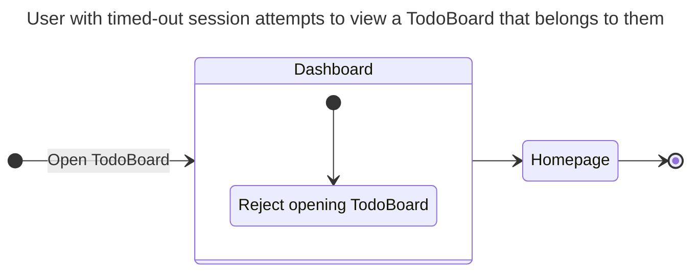
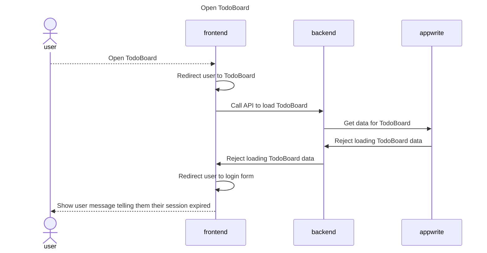
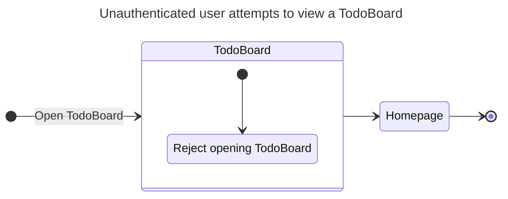
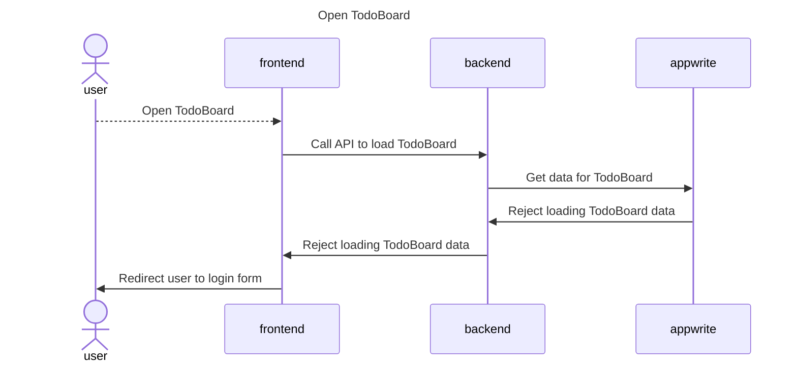

# Viewing a TodoBoard

## Happy Path Flows

### Authenticated user views a TodoBoard that belongs to them
Persona: [Authenticated user](../personas/authenticated-user.md)

#### Flow

#### Sequence Diagrams
##### Open TodoBoard

## Alternate Path Flows
### Authenticated user attempts to view a TodoBoard that doesn't belong to them
Persona: [Authenticated user](../personas/authenticated-user.md)

#### Flow

#### Sequence Diagrams
##### Open TodoBoard

### User with timed-out session attempts to view a TodoBoard that belongs to them
Persona: [User with timed-out session](../personas/user-with-timed-out-session.md)

#### Flow

#### Sequence Diagrams
##### Open TodoBoard

### Unauthenticated user attempts to view a TodoBoard
Persona: [Unauthenticated user](../personas/unauthenticated-user.md)

#### Flow

#### Sequence Diagrams
##### Open TodoBoard
